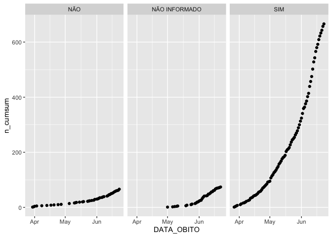

Óbitos COVID
================

``` r
df <- read_excel("data-raw/OBITOS_CONF_COVID-19_MG_25.06.2020.xls", range = "A3:F809")

names(df) <- c("PACIENTE", "SEXO", "IDADE", "MUNICIPIO_RESIDENCIA", "DATA_OBITO", "COMORBIDADE")

df %>% 
    mutate(COMORBIDADE = case_when(
    COMORBIDADE == "NAO" ~ "NÃO",
    COMORBIDADE == "Não informado" ~ "NÃO INFORMADO",
    TRUE ~ COMORBIDADE
  )) %>% 
  count(DATA_OBITO, COMORBIDADE) %>% 
  group_by(COMORBIDADE) %>% 
  mutate(n_cumsum = cumsum(n)) %>% 
  ggplot(aes(x = DATA_OBITO, y = n_cumsum)) +
  geom_point() +
  facet_wrap(~ COMORBIDADE)
```

<!-- -->
